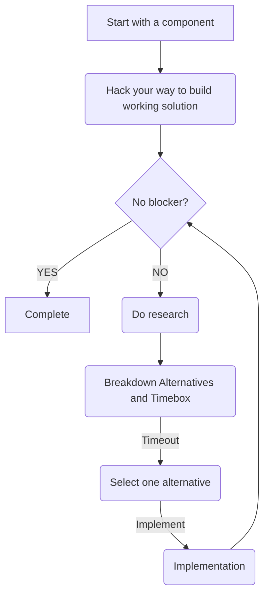

# Proposal

## Problem Statement

WIP: typing...

## Potential Solution

### Components

This project can be broken down to the following components
- Generative AI
  - PFP Image Generator
    - Generative Prompts
    - Image seeder
    - Image theme templates
    - Finetune Generative Model
- Web Development
  - NFT Collection Creator Wizard (ala POAP)
  - NFT Collection Minter 
  - NFT Gallery
    - Newest collection
    - Popular collection
- Smart Contract
  - NFT Contract 

### Research Aspects

- How to generate 10k of similar images with parameterized inputs?
- Finetune models?
- Which generative model provide the best results in terms of quality vs costs?
- Usage of Account Abstraction?
- How to utilize Wei Jie's zkNFT?

### Approach to Research

